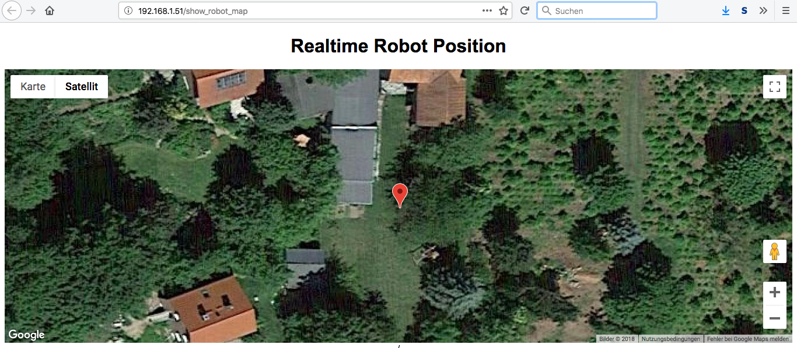

# Robotan
Die deutsche Version gibt es <A HREF="README_de.md">hier</A>.  

WiFi access to Zucchetti-based lawnmower robots (Ambrogio, Stiga, Herkules etc.)  
See a list of (partly still assumed) compatible robots <A HREF="Supported Models.md">here</A>.  
Some boards left over from a collective order are still available. Contact robotan (ät) code-it.de if you are interested (German or English).

<H2><A HREF="LICENSE.md">License</A></H2>
<H2><A HREF="Assembly Instructions.md">Building the Robotan board</A></H2>
<H2><A HREF="Installation.md">Installation</A></H2>
<H2><A HREF="Setup.md">Software Setup</A></H2>
<H2><A HREF="Configuration.md">Configuration</A></H2>
<H2><A HREF="Troubleshooting.md">Troubleshooting</A></H2>
<H2><A HREF="FAQ.md">Frequently Asked Questions (FAQ)</A></H2>

<B>Some screenshots:</B>  

<B>Web-based remote control:</B>

<B>Web interface with configuration and status information:</B>

<B>General settings (incl. GPS):</B>

  

<B>Screencapture of realtime robot movements (new position polled every 10 seconds):</B>  

<A HREF="./img/Robot-Realtime-Position.mp4?raw=true">Watch video (1:04 min, 10 MB)</A>  
 

