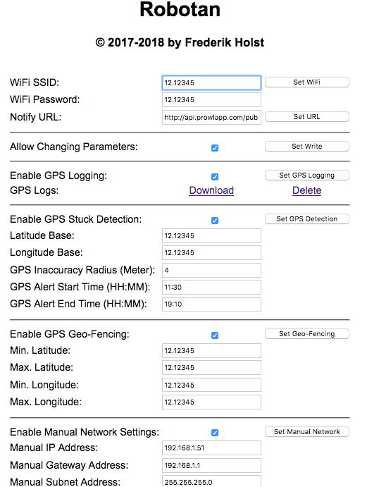

# Robotan
English version can be found <A HREF="README.md">here</A>.  

WLAN Steuerung für Zucchetti-basierte Rasenmähroboter (Ambrogio, Stiga, Herkules etc.)  
<A HREF="Supported Models_de.md">Hier</A> gibt es eine Liste der (z.T. vermutlich) kompatiblen Roboter.

<H2><A HREF="LICENSE_de.md">Nutzungslizenz</A></H2>
<H2><A HREF="Assembly Instructions_de.md">Zusammenbau des Robotan Boards</A></H2>
<H2><A HREF="Installation_de.md">Installation</A></H2>
<H2><A HREF="Setup_de.md">Software Setup</A></H2>
<H2><A HREF="Configuration_de.md">Konfiguration</A></H2>
<H2><A HREF="Troubleshooting_de.md">Fehlersuche</A></H2>
<H2><A HREF="FAQ_de.md">Häufig gestellte Fragen (FAQ)</A></H2>

<B>Einige Screenshots:</B>  

<B>Web-basierte Fernsteuerung:</B>

<B>Web-Interface mit Konfigurations- und Statusinformationen:</B>

<B>Allgemeine Konfigurationsoptionen (inkl. GPS):</B>

  

<B>Screencapture von Echtzeit-Verfolgung der Roboterbewegung:</B>  

<A HREF="./img/Realtime%20Robot%20Position.mp4">Download Video (10 MB)</A>  
