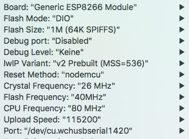

<H2>Installing and updating the Robotan firmware</H2>
Die deutsche Version befindet sich <A HREF="Setup_de.md">hier</A>.
  
The procedures of installing and updating are slightly different, but once a firmware is installed, you can always use the browser-based
update function described further below.

<H3>Installing the firmware for the first time</H3>
If you want to install the Robotan firmware on a fresh Wemos D1 device which does not have a firmware installed, 
you have follow the following steps:

1. Download and install the Arduino IDE as well as the ESP8266 core as described <A HREF="https://github.com/esp8266/Arduino#installing-with-boards-manager">here</A>.

2. In the Arduino IDE, set the following parameters in the "Tools" menu:

3. Connect the Wemos D1 with your computer via USB but WITHOUT THE ROBOTAN BOARD ATTACHED and flash the <A HREF="RobotanSetup.ino">RobotanSetup.ino</A>.  
Before flashing, you may set individual credentials for your personal WiFi 
network (variables WLAN_local_SSID and WLAN_local_password) as well as for the 
username and password for the webinterface (variables http_username and 
http_password). These will then be stored in the module and used instead of the 
default ones mentioned below.

4. Now a minimal browser-based firmware update program is installed on the Wemos D1 and you can proceed with the updating procedures explained below.

<H3>Updating the firmware via the web browser</H3>
Updating only works if a Robotan firmware or the RobotanSetup.ino has been installed before! 
If that is not the case, please go back to the beginning of this page and install the RobotanSetup.ino first.
Otherwise follow these steps:

1. Download the most recent <A HREF="Robotan.ino.bin">Robotan.ino.bin</A> and save it on your computer.

2. Connect to the robot's WiFi network. The default network name is "Robotan" and the WiFi password is "Robotan88" (without quotation marks).
If you have configured Robotan to use your existing WiFi network, you have to be connected to that WiFi network instead.

3. Open the following URL if you use the Robotan default WiFi, otherwise replace the IP number with the IP the Robotan has in your local WiFi network:  
`http://192.168.4.1:8080/update`  
If you are asked for a login, the defautl username is "Robotan" and the password is "Robotan88". If you have configured your own credentials, of course you have to use them instead. 

4. Browse to the Robotan.ino.bin you have downloaded before and click "Update".

5. If the upload was successful, Robotan will reboot and after a short while you should be able to access the Robotan web interface at
`http://192.168.4.1`.
If you have cofigured Robotan to use your own WiFi network, these settings will still be there, so you can access the web interface via
the IP number you have used before.  
If you are asked for a login, the username is "Robotan" and the password is "Robotan88", unless you have configured your own individual username/password. 
  
<B>Please note: Each time you insert the Robotan board into your robot, 
you will be asked for a PIN password on your robot.</B>  
This is the PIN you have assigned your robot during setup and is by default 0000. 
<B>Unless the robot is authenticated, you won't be able to control it!</B> 
In case you do not enter the PIN quickly enough, you might have to turn the 
robot off and on again, as it checks for authentication soon after powering on.

<H3>Done :-)!</H3>
